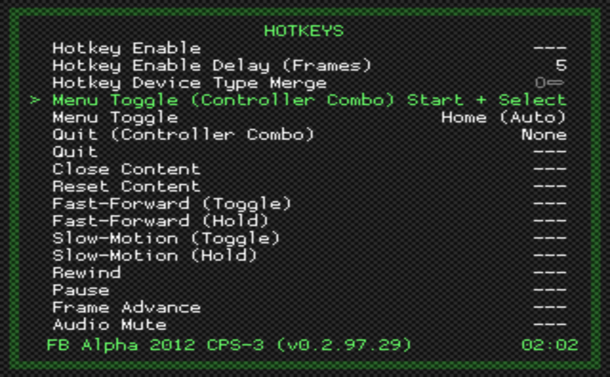
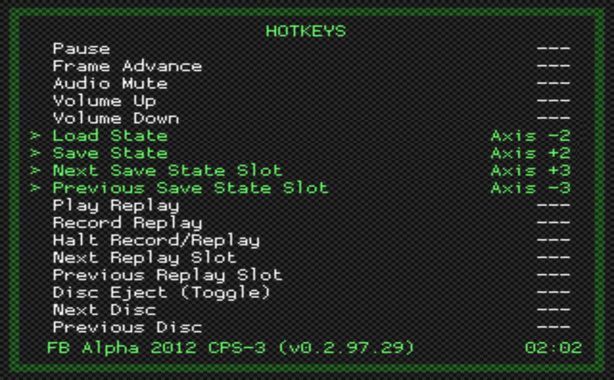

## 目录相关的设置

需要进行设置的目录有 3 个：

设置项名称 | 说明 | 备注
:--- | :--- | :---
Thumbnails | 缩略图目录 | thumbnails_directory = "sd:/retroarch/thumbnails"
File Browser | 文件浏览器的开始目录 | rgui_browser_directory = "sd:/Games/Arcade (FB Alpha 2012 CPS-3)"
Playlists | 游戏列表目录 | playlist_directory = "sd:/apps/fbalpha2012_cps3/playlists"

设置步骤如下：

第 1 步，进入 DIRECTORY 设置界面：MAIN MENU > Settings > Directory

第 2 步，设置项 Thumbnails 表示缩略图目录：

第 3 步，进入 sd:/retroarch/thumbnails 文件夹后，选择 \<Use This Directory\>：

第 4 步，缩略图目录已被设置为 sd:/retroarch/thumbnails：

第 5 步，设置项 File Browser 表示文件浏览器的开始目录，将其设置为 sd:/Games/Arcade (FB Alpha 2012 CPS-3)：

第 6 步，设置项 Playlists 表示游戏列表目录，将其设置为 sd:/apps/fbalpha2012_cps3/playlists：

## 在游戏列表中显示缩略图

第 1 步，进入 APPEARANCE 设置界面：MAIN MENU > Settings > User Interface > Appearance

第 2 步，按照下表的设置项名称，修改各个设置项的取值：

设置项名称 | 取值 | 说明 | 备注
:--- | :--- | :--- | :---
Show Playlists Thumbnails | ON | 打开显示缩略图开关 | rgui_inline_thumbnails = "true"
Top Thumbnail | Title Screen | 标题画面（起始屏幕）在上 | menu_thumbnails = "2"
Bottom Thumbnail | Screenshot | 游戏画面（截屏）在下 | menu_left_thumbnails = "1"

第 3 步，进入游戏列表界面：MAIN MENU > Playlists > 列表名称，可以看到缩略图的显示效果：

Wii 版的 RetroArch 对缩略图的处理主打的是模糊不清，图片再好看再高清看上去也是糊成一坨。因此我只选择了分辨率较小的 Title Screen 和 Screenshot。

## 在游戏过程中使用手柄的左摇杆

第 1 步，进入 RETROPAD BINDS 设置界面：MAIN MENU > Settings > Input > RetroPad Binds，可以看到 APP 预设的 8 个端口控制菜单项：

第 2 步，进入 PORT 1 CONTROLS 设置界面，Analog to Digital Type 当前的取值为 None，这会导致在游戏过程中无法使用手柄的左摇杆：

第 3 步，把 Analog to Digital Type 的取值修改为 Left Analog：

第 4 步，以此类推，进入其他端口控制设置界面，修改 Analog to Digital Type 的取值：

## 快捷键相关的设置

第 1 步，进入 HOTKEYS 设置界面：MAIN MENU > Settings > Input > Hotkeys

第 2 步，按照下表设置游戏过程中，菜单切换的快捷键：

设置项名称 | 取值 | 说明 | 备注
:--- | :--- | :--- | :---
Menu Toggle (Controller Combo) | Start + Select | 同时按 Start 和 Select 几乎适用于所有手柄和摇杆 | input_menu_toggle_gamepad_combo = "4"
Menu Toggle | Axis +2 | 右摇杆的右 适用于有右摇杆的手柄 | input_menu_toggle_axis = "+2"

第 3 步，按照下表设置读取进度和保存进度的快捷键：

设置项名称 | 取值 | 说明 | 备注
:--- | :--- | :--- | :---
Load State | Axis -3 | 右摇杆的上 读取进度 | input_load_state_axis = "-3"
Save State | Axis +3 | 右摇杆的下 保存进度 | input_save_state_axis = "+3"

## 精简 MAIN MENU 界面

精简前的界面：

精简后的界面：

设置步骤如下：

第 1 步，进入 MENU ITEM VISIBILITY 设置界面：MAIN MENU > Settings > User Interface > Menu Item Visibility

第 2 步，按照下表的设置项名称，修改各个设置项的取值：

设置项名称 | 取值 | 说明 | 备注
:--- | :--- | :--- | :---
Show 'Load Core' | OFF | 隐藏 Load Core APP 启动的时候会自动加载核心 | menu_show_load_core = "false"
Show 'Load Content' | OFF | 隐藏 Load Content APP 通过 Playlists 加载游戏 | menu_show_load_content = "false"
Show 'Infomation' | OFF | 隐藏 Infomation R-Sam 用不到 | menu_show_information = "false"
Show 'Configuration File' | OFF | 隐藏 Configuration File R-Sam 用不到 | menu_show_configurations = "false"
Show 'Netplay' | OFF | 隐藏 Netplay R-Sam 用不到，也不会用 | content_show_netplay = "false"

## 精简 PLAYLISTS 界面

精简前的界面：

精简后的界面：

设置步骤如下：

第 1 步，进入 MENU ITEM VISIBILITY 设置界面：MAIN MENU > Settings > User Interface > Menu Item Visibility

第 2 步，按照下表的设置项名称，修改各个设置项的取值：

项目 | 取值 | 说明 | 备注
:--- | :--- | :--- | :---
Show 'Import Content' | OFF | 隐藏 Import Content Playlists 中已经包含所有游戏，不再需要导入 | content_show_add_entry = "0"
Show 'Favorites' | OFF | 隐藏 Favorites CPS3 总共就 6 个游戏，没必要收藏 | content_show_favorites = "false"
Show 'Explore' | OFF | 隐藏 Explore R-Sam 用不到，也不会用 | content_show_explore = "false"

## 精简游戏的快捷菜单界面

精简前的界面：

精简后的界面：

设置步骤如下：

第 1 步，进入 QUICK MENU 设置界面：MAIN MENU > Settings > User Interface > Menu Item Visibility > Quick Menu

第 2 步，按照下表的设置项名称，修改各个设置项的取值：

设置项名称 | 取值 | 说明 | 备注
:--- | :--- | :--- | :---
Show 'Rewind' | OFF | 隐藏 Rewind R-Sam 用不到，也不会用 | menu_show_rewind = "false"
Show 'Set Core Association' | OFF | 隐藏 Set Core Association Playlists 中已经设置了核心，不再需要设置 | quick_menu_show_set_core_association = "false" 
Show 'Reset Core Association' | OFF | 隐藏 Reset Core Association Playlists 中已经设置了核心，不再需要重设 | quick_menu_show_reset_core_association = "false"
Show 'Download Thumbnails' | OFF | 隐藏 Download Thumbnails 缩略图目录里已经包含了缩略图，不再需要下载 | quick_menu_show_download_thumbnails = "false"

