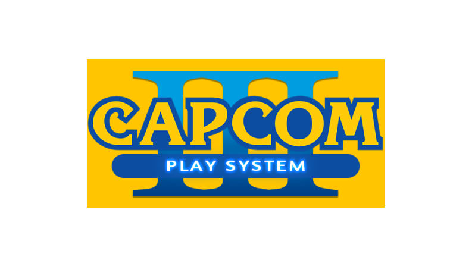
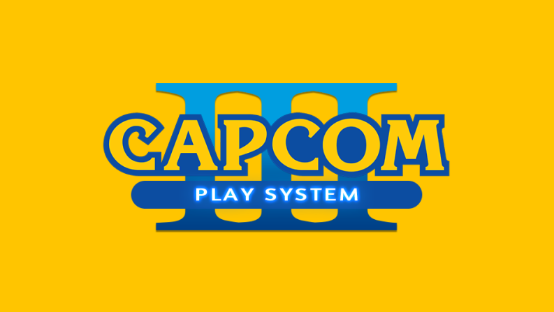
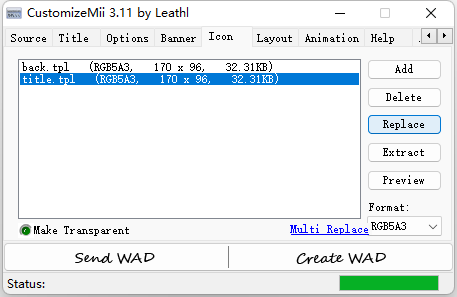

# CPS3 频道 Icon 的制作步骤

制作思路就是以上图为前景图层，居中叠加在另外一张纯色的背景图层之上。

以下步骤使用 Windows 自带的画图即可完成。

Step 1. 准备一张 500 x 250 的纯色图片，例如：

Step 2. 把 `cps3.fg.png` 粘贴到到纯色图片之上：

Step 3. 拖拽图片的左边，使图片的总宽度变为 646：

Step 4. 拖拽图片的上边，使图片的总高度变为 349：

Step 5. 拖拽图片的右边，使图片的总宽度变为 793：

Step 6. 拖拽图片的下边，使图片的总高度变为 447：

Step 7. 使用颜色选取器，填充拖拽产生的边框部分颜色：

Step 8. 将图片缩小成 170 x 96，即得到制作频道所需的 Icon 图片：

Step 9. 将图片另存为 `title.png`，使用 `CustomizeMii.exe` 替换 Icon 选项卡里的 `title.tpl` 即可，注意 Format 类型要选择 RGB5A3：

